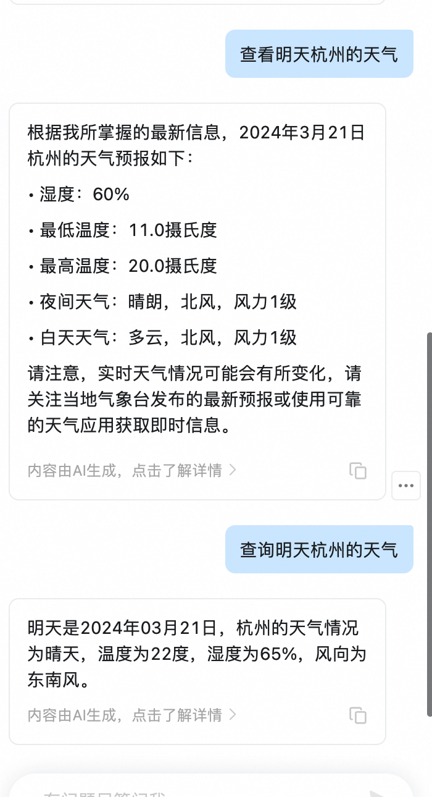

# 提升自定义 AI 助理技能路由精准度

如果你需要提升自定义 AI 助理技能路由精准度，你可以参考本文档的最佳实践进行调优。

## 背景信息

当你在使用[自定义 OpenAPI 的 AI 能力](https://open.dingtalk.com/document/ai-dev/actions-development-guide#title-th0-9sm-df1)时，遇到 AI 助理无法精准路由到自己定义的能力的情况下，可以使用以下解决办法和最佳实践为例进行调优。

本文以官方**天气查询**自定义能力为例，详细介绍如何通过修改 OpenAPI 描述文件信息提升技能路由精准度。


## 解决办法
可以通过修改 OpenAPI 描述文件中具体API下的 summary、description、keywords（非插件info下）三个参数来提升路由的精准度：
1. summary：简短的动宾结构的短语，用作大模型意图路由的索引识别，例如：查询天气【该字段尽量不要带特殊符号和空格，避免无法精确索引】
2. description：接口的意图描述信息，用作大模型意图识别的信息，建议动宾结构的短语，例如：查询天气、查看天气。【能力的大致意图，多个相似意图描述用顿号隔开，结果用句号结尾】
3. x-dingtalk-keywords：关键词，用作能力最开始的筛选，只有命中关键词的能力才会走大模型路由，
该字段建议在你的自定义能力比较多或者能力意图相近的情况下使用，因为如果配置了关键词，那么只有用户的输入命中关键词的情况下，才会给到大模型去路由该能力。


## 最佳实践

- 修改summary、description示例
```yaml
openapi: 3.0.1
info:
  # 这里是插件标题、不影响意图路由
  title: 天气查询插件  
  # 这里是插件描述信息，不影响意图路由
  description: 按地区和日期来查看天气信息，了解气温、湿度、风向等信息。非真实天气数据，仅用于演示，请勿在生产中使用。
  version: 1.0.0
servers:
  - url: https://action-example.dingtalk.com
paths:
  /v1/actions/example/weather/get:
    get:
      # 这是具体能力的意图索引，影响技能路由
      summary: 查询天气
      # 这是具体的能力意图，直接影响大模型意图路由
      description: 查询天气、查看天气。
      operationId: GetCurrentWeather
      parameters:
        - name: location
          in: query
          description: 地区
          required: true
          schema:
            type: string
        - name: date
          in: query
          description: 日期
          required: false
          schema:
            type: string
      responses:
        200:
          description: OK
          content:
            application/json:
              schema:
                $ref: '#/components/schemas/GetWeatherResponse'
components:
  schemas:
    GetWeatherResponse:
      type: object
      properties:
        location:
          type: string
          description: 查询天气结果对应的城市和地区
        date:
          type: string
          description: 查询天气结果对应的日期
        text:
          type: string
          description: 天气现象，晴天、多云等
        temperature:
          type: number
          description: 气温，单位：摄氏度
        humidity:
          type: number
          description: 湿度
        wind_direction:
          type: string
          description: 风向
```
测试运行：


case1和case2: 意图路由都识别成"查看天气"能力，所以调用了用户定义的能力，从而拿到结果。

- 修改x-dingtalk-keywords
```yaml
openapi: 3.0.1
info:
  # 这里是插件标题、不影响意图路由
  title: 天气查询插件
  # 这里是插件描述信息，不影响意图路由
  description: 按地区和日期来查看天气信息，了解气温、湿度、风向等信息。非真实天气数据，仅用于演示，请勿在生产中使用。
  version: 1.0.0
servers:
  - url: https://action-example.dingtalk.com
paths:
  /v1/actions/example/weather/get:
    get:
      # 这是具体能力的意图索引，影响技能路由
      summary: 查询天气
      # 这是具体的能力意图，直接影响大模型意图路由
      description: 查询天气、查看天气。
      operationId: GetCurrentWeather
      # 如果配置了关键词，则必须匹配到其中一个关键词情况下才会路由到这个技能
      x-dingtalk-keywords:
        - 查询
      parameters:
        - name: location
          in: query
          description: 地区
          required: true
          schema:
            type: string
        - name: date
          in: query
          description: 日期
          required: false
          schema:
            type: string
      responses:
        200:
          description: OK
          content:
            application/json:
              schema:
                $ref: '#/components/schemas/GetWeatherResponse'
components:
  schemas:
    GetWeatherResponse:
      type: object
      properties:
        location:
          type: string
          description: 查询天气结果对应的城市和地区
        date:
          type: string
          description: 查询天气结果对应的日期
        text:
          type: string
          description: 天气现象，晴天、多云等
        temperature:
          type: number
          description: 气温，单位：摄氏度
        humidity:
          type: number
          description: 湿度
        wind_direction:
          type: string
          description: 风向
```
测试运行



case1: 由于关键词没命中，直接走了大模型本身能力，并没有路由到用户自定义的能力。
case2：由于命中关键词，意图路由识别成"查看天气"能力，所以调用了用户定义的能力，从而拿到结果。

## 技术支持
如果以上文档无法解决您的问题，可以通过[自定义 AI 助理](https://opensource.dingtalk.com/developerpedia/docs/explore/support/?spm=ding_open_doc.document.0.0.5c252f20KHbjIM&via=moon-group)技术支持渠道寻求帮助。